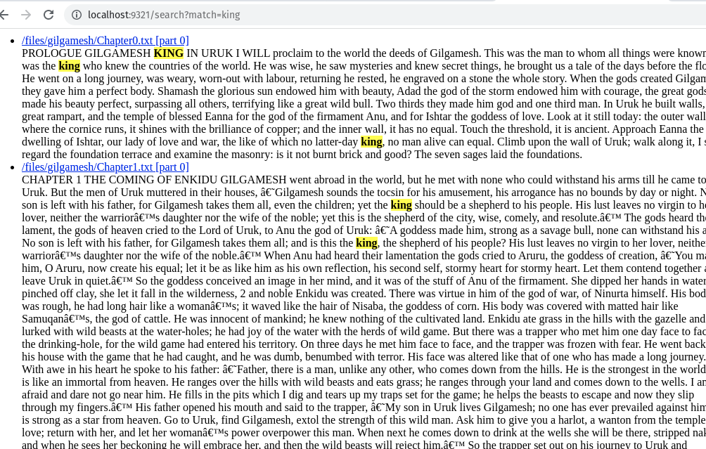

# GoSQLite

Requirements:

- Docker
- Docker Compose

This is an experiment in quickly creating a Content Management System (CMS), by which I mean

- upload and download files
- large media files, such as multi-GB mp4s work well and efficiently
- install tarballs of entire static apps (ie: React apps, html pages)
- simple GET/POST to urls to alter content

Note:

- Actual files are just stored on filesystem, while derived items are stored in sqlite3
- all directories are created IMPLICITLY.
- metadata about a directory or file can be uploaded before or after the content
- This allows you to use, or ignore permissions as you see fit
- If you come in authenticated, specific CRUD permissions will be evaluated
- The permission system will allow quite arbitrary rules, as the CRUD permissions
  will be calcualted by code provided by the client; to evaluate a JWT claim for CRUD access.
  (TODO, but I have done this a few times from scratch in a few days) 
- The point of this is to not only allow for anonymous or strongly controlled
  read, but pseudononymous writes as well. ie: GDPR cases, such as directory
  open to adults living in certain countries.
  
Todo:

- reverse proxy endpoints (A few hundred lines of code at most, as I write reverse proxies often)
- the reverse proxy endpoints would allow full apps to work 
- OpenPolicyAgent for security enforcement, I did this in a separate project, and it took a few hours.

```
# runs on http://localhost:9321
./cleanbuild
```


## API

The API is meant to be as trivial as possible, such that curl examples are more than sufficient.
Currently, there are just GET and POST, where certain prefixes are special.

- POST or GET to `/files/${URL}` means to write the file blob to the given URL.  Not having any kind of oid means that URLs must uniquely identify files (where oids, which I don't want to support) would complicate this.
- a POST to `/files/${URL}` with a parameter `installed=true` means to expect a tarball, and the url is specifying the directory in which it goes.
- GET `/search/${URL}?match=${term}` with a term that you are looking for will render a simple html page of hits.

Install a react app in a tarball, or a simple html app.  Install means to expect a tarball, and unpack it into the named directory.

> in package.json, `homepage="."` so that the react app can be mounted anywhere in the tree.

## Examples

> All directories are created as a side-effect.  But before or after uploading file, it's a TODO to be able to upload metadata such as permissions.  In that case, upload permissions before files.

```
(
  cd `dirname $0`
  ( cd app && tar cvf ../app.tar . ) 
  curl -X POST --data-binary @app.tar http://localhost:9321/files/app/v1?install=true
)

```

The API is designed to be easily explored from a web browser.  A few things are not completely obvious though.
If you want a json rendition to a directory listing, or a search, then add `json=true` http parameter:

```
GET http://localhost:9321/files/documents/?json=true
GET http://localhost:9321/search?json=true&match=king
```

Upload a normal file, one by one

```
  curl -X POST --data-binary @resume.pdf http://localhost:9321/files/doc/rob/resume.pdf
```

Search by keyword king:

```
http://localhost:9321/search?match=king
```



Note that if you setup Google Vision, when you upload images, they can be labeled and found in the search; indirectly, through the labelling.  Here is a hit on a dog, for a file with an uninformative name.


Adding reverseproxy endpoints to make full-blown apps work will be easy. Permission system for safe updates a little less so, but not hard.
